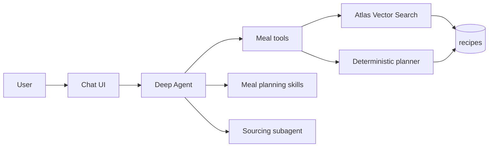
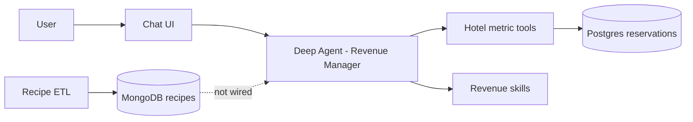

# Current Repository Analysis — `weekly-recipe-agent`

**Generated:** 2026-06-24  
**Branch:** `main` (2 commits; latest: recipe ETL refactor)  
**Status:** **Transitional** — Phase 1 (recipe ETL → MongoDB) is largely implemented; the agent, API, skills, tests, and deploy stack still target the original **Hotel Revenue Manager** brief.

---

## 1. Executive summary

This repository started as a **LangChain Deep Agents** hackathon template for a **hotel GM Revenue Manager** (Postgres + reservation metrics). It is being refactored into a personal **Weekly Meal Suggester** backed by the **Indian Food dataset** (~6,871 recipes) and **MongoDB Atlas hybrid RAG** (vector search + deterministic planning).

| Area | State |
|------|--------|
| **Vision / plan** | Documented in `BUILD_PLAN.md` (locked product decisions, 5 phases) |
| **Recipe ETL (Phase 1)** | ✅ Implemented — xlsx → transform → MongoDB load → verify |
| **Vector index + smoke test** | ✅ Scripts ready; requires `mongodb-atlas-local:preview` + `VOYAGE_API_KEY` |
| **Meal-planning tools (Phase 2)** | ❌ Not started — no `suggest_week_plan`, `semantic_search_recipes`, etc. |
| **Deep Agent wiring (Phase 3+)** | ⚠️ **Legacy hotel agent** still live — Postgres tools, revenue skills, GM prompt |
| **Deploy** | ⚠️ `render.yaml` / `Dockerfile` still Postgres + hotel agent; MongoDB not wired |

**Bottom line:** The data plane is moving to recipes; the intelligence plane is still a fully built hotel revenue manager waiting to be swapped for meal-planning tools, skills, and prompts per `BUILD_PLAN.md`.

---

## 2. Product intent

### Target product (from `BUILD_PLAN.md`)

- **User ask:** “What should I eat this week?”
- **Output:** 7 days × 3 main-dish options (21 distinct recipes), mostly Indian (~5:2 Indian-to-variety split), non-veg included, no cook-time cap.
- **Architecture:** **Hybrid retrieval**
  - **Atlas Vector Search** (Voyage `autoEmbed` on `embed_text`) for semantic queries (“comforting lentil dish”, “like paneer butter masala but lighter”).
  - **Deterministic Python planner** for hard guarantees: no repeats, cuisine mix, exactly 21 picks.
- **Framework:** Keep all Deep Agents blocks (tools, skills, subagents, planning, memory, HITL) for portfolio/demo value.

### What still runs today

The deployed/local agent answers **hotel revenue questions** (OTB, ADR, segment mix, OTA dependency, cancellations, etc.) against **Postgres** `reservations_hackathon`, not recipe questions against MongoDB.

---

## 3. Technology stack

| Layer | Technology |
|-------|------------|
| **Language** | Python 3.12 (Docker) / 3.14 (local `__pycache__` artifacts) |
| **Agent framework** | `deepagents` ≥0.6, `langgraph` ≥0.4, LangChain model adapters |
| **Default model** | `google_genai:gemini-2.5-flash` (override via `AGENT_MODEL`) |
| **Recipe datastore** | MongoDB (`pymongo`) — local: `mongodb/mongodb-atlas-local:preview` |
| **Embeddings** | Atlas Automated Embedding (Voyage `voyage-4-lite`) — server-side, no client embed lib |
| **Legacy hotel DB** | PostgreSQL 16 (`psycopg`) — still used by agent tools |
| **API** | FastAPI + SSE streaming + basic auth middleware |
| **UI** | Custom static chat (`static/index.html`) — streams tool/skill/subagent events |
| **ETL input** | `IndianFoodDatasetXLS.xlsx` (6,871 rows) via `pandas` + `openpyxl` |
| **Tests** | `pytest` — unit tests for recipe transform; integration tests need live MongoDB |
| **Deploy (current)** | Render Blueprint — Docker web service + Render Postgres (`render.yaml`) |

---

## 4. Repository layout

```
weekly-recipe-agent/
├── BUILD_PLAN.md              # Refactor roadmap (source of truth for target state)
├── CURRENT_REPOSITORY.md      # This file
├── IndianFoodDatasetXLS.xlsx  # Source dataset (~6.8k recipes)
├── docker-compose.yml         # MongoDB atlas-local + legacy Postgres
├── schema.sql                 # Hotel Postgres schema (legacy)
├── requirements.txt           # Dev deps (pandas, pymongo, pytest, deepagents, …)
├── requirements-prod.txt        # Slim prod image (no pandas/xlsx — ETL not in container)
│
├── etl/                       # ✅ Recipe pipeline (Phase 1)
│   ├── config.py              # Mongo + dataset constants
│   ├── extract.py             # read xlsx
│   ├── transform.py           # normalize Course/Diet/Cuisine → RecipeDocument
│   ├── embed.py               # build embed_text string (no vectors stored)
│   ├── load.py                # drop-and-reload into `recipes` collection
│   ├── verify.py              # count/field checks + optional index READY poll
│   └── run_etl.py             # orchestrator + idempotency proof
│
├── scripts/
│   ├── create_atlas_index.py  # autoEmbed vector index on `recipes`
│   ├── smoke_vector_search.py # $vectorSearch smoke test
│   └── load_atlas.py          # convenience wrapper for remote ETL
│
├── agent/                     # ⚠️ Hotel Revenue Manager (pre-refactor)
│   ├── graph.py               # create_deep_agent() assembly
│   ├── config.py              # model, paths, checkpoint, auth
│   ├── db.py                  # Postgres read-only SQL guard
│   ├── semantic.py            # month resolution, metric helpers (hotel)
│   ├── tools/                 # 12 hotel metric tools + run_sql
│   └── knowledge/
│       ├── AGENTS.md          # grain traps, delegation rules (hotel)
│       └── skills/            # 10 revenue-management SKILL.md files
│
├── api/                       # FastAPI chat + SSE (hotel-titled)
├── prompts/system_prompt.md   # GM briefing persona (hotel)
├── static/index.html          # Chat UI (“Revenue Manager Agent”)
├── tests/                     # Mixed: recipe transform + hotel metric tests
├── data/                      # Cached hotel scrape JSON + verify targets (legacy)
├── docs/                      # Hotel data model / ground truth docs (legacy)
└── render.yaml                # Render deploy (hotel Postgres, not Mongo)
```

---

## 5. Implementation status by phase

### Phase 1 — ETL: xlsx → MongoDB ✅ (implemented)

**Pipeline:** `python -m etl.run_etl` → extract → transform → load → verify → optional idempotent reload proof.

| Step | Module | Notes |
|------|--------|-------|
| Extract | `etl/extract.py` | Reads `IndianFoodDatasetXLS.xlsx` |
| Transform | `etl/transform.py` | `display_name`, `meal_slot`, `is_main`, `cuisine_group`, `is_veg`, `effort_bucket`, `ingredients[]`, `embed_text` |
| Load | `etl/load.py` | `delete_many` + `insert_many` into `weekly_recipes.recipes` |
| Verify | `etl/verify.py` | 6,871 total docs; ~2,862 `is_main` (±5); no missing `display_name`/`embed_text`; ≥70% Indian mains |

**Document shape** (`etl/models.py` → `RecipeDocument`):

- `_id` = `Srno`
- Denormalized filters: `cuisine_group` (`Indian` | `Variety`), `is_main`, `diet`, `is_veg`
- `embed_text` = `display_name | cuisine | ingredients` (Atlas auto-embeds this)

**Index setup:** `python scripts/create_atlas_index.py` creates `recipe_vec` with:

- `autoEmbed` on `embed_text` (`voyage-4-lite`)
- Filter fields: `is_main`, `cuisine_group`, `diet`

**Smoke test:** `python scripts/smoke_vector_search.py` — polls index READY, runs `$vectorSearch` with `query: { text: "comforting lentil curry" }`.

**Config** (`etl/config.py`):

```python
EXPECTED_TOTAL_DOCS = 6871
EXPECTED_MAIN_DOCS = 2862
MONGODB_URI = mongodb://localhost:27017/weekly_recipes?directConnection=true
VECTOR_SEARCH_INDEX = "recipe_vec"
```

### Phase 2 — Meal-planning tool layer ❌ (not started)

Planned tools (from `BUILD_PLAN.md`) — **none exist in code yet:**

| Tool | Purpose |
|------|---------|
| `semantic_search_recipes` | `$vectorSearch` + metadata pre-filters |
| `suggest_week_plan` | 7×3 distinct recipes, 5:2 cuisine mix, deterministic seed |
| `swap_day` | Re-roll one day’s options |
| `search_recipes` | MQL `find()` for structured filters |
| `get_recipe_detail` | Full recipe by `_id` |

`agent/tools/__init__.py` still exports **hotel** tools only (`revenue_on_books`, `segment_mix`, `ota_dependency`, …).

### Phase 3 — Deep Agents rewire ❌ (not started)

Current `agent/graph.py` builds a **Revenue Manager** agent with:

- **12 tools** on orchestrator (11 metric tools + `run_sql` behind HITL)
- **Subagents:** `data-analyst` (metric fetch), `revenue-strategist` (narrative)
- **Skills:** 10 hotel topics under `agent/knowledge/skills/`
- **Memory:** `AGENTS.md` (grain traps, delegation)
- **HITL:** `interrupt_on` for `run_sql` only

Planned meal-agent blocks (sourcing subagent, meal-planning skill, `user_prefs` memory) are not implemented.

### Phase 4 — Output format ❌

No week-plan formatter; hotel briefing scaffold (BLUF + drivers + risk + action) is in the system prompt.

### Phase 5 — Local dev & deploy ⚠️ (partial)

| Component | Status |
|-----------|--------|
| Local MongoDB | ✅ `docker-compose.yml` — `mongodb/mongodb-atlas-local:preview` + `VOYAGE_API_KEY` |
| Local Postgres | ⚠️ Still present for legacy agent (`hackathon` / `hotel_hackathon`) |
| ETL local workflow | ✅ Documented in `BUILD_PLAN.md`; scripts ready |
| Prod MongoDB Atlas | ❌ Not wired into agent or `render.yaml` |
| Prod deploy | ⚠️ `render.yaml` → Render Postgres + Docker hotel agent |
| `Dockerfile` | Copies only `agent/`, `api/`, `prompts/`, slim `etl/config.py` — **no recipe ETL in image** |

---

## 6. Data layer detail

### Recipe dataset (new)

- **Source:** `IndianFoodDatasetXLS.xlsx` at repo root
- **Collection:** `weekly_recipes.recipes`
- **Pool for weekly planning:** `is_main: true` → ~2,862 docs (~77% Indian mains)
- **Transform rules:** Indian vs Variety cuisine classification; `Course` normalized; “Vegetarian” as course treated as data error; diet drives `is_veg`

### Hotel dataset (legacy, still powering agent)

- **Postgres tables:** `reservations_hackathon`, lookup tables (`schema.sql`)
- **Cached scrape JSON:** `data/raw_reservations.json`, `data/raw_lookups.json`, etc.
- **Grain:** reservation × stay_date (455 rows in brief; agent tools enforce this)
- **Semantic layer:** `agent/semantic.py`, `etl/metric_windows.py` (hotel date windows)

The agent’s `agent/db.py` connects exclusively to **Postgres** via `DATABASE_URL`. There is **no** `pymongo` usage in `agent/` yet.

---

## 7. Agent layer (current — hotel)

### Tool surface (`agent/tools/`)

| Tool | Domain |
|------|--------|
| `describe_dataset` | As-of date, label maps |
| `revenue_on_books` | OTB by month |
| `segment_mix` | Segment/channel breakdown |
| `adr_analysis` | ADR by dimension |
| `whats_changed` | Recent pickup |
| `booking_pace` | Pace vs expectations |
| `stly_comparison` | Same time last year |
| `ota_dependency` | OTA concentration |
| `concentration` | Key-account risk |
| `cancellations` | Attrition |
| `group_vs_transient` | Group displacement |
| `run_sql` | Escape hatch (HITL-gated) |

### Skills (`agent/knowledge/skills/`)

Ten revenue-management skills, e.g. booking pace, OTA strategy, cancellations, ADR, concentration risk, briefing style, data traps, STLY, group vs transient, “what’s driving a period”.

### System prompt (`prompts/system_prompt.md`)

GM briefing persona: BLUF-first, tool-first, grain discipline, USD only, progressive skill loading.

### API (`api/main.py`)

- FastAPI app titled **“Revenue Manager Agent”**
- SSE streaming via `api/streaming.py`
- Basic auth middleware (`BASIC_AUTH_USER` / `BASIC_AUTH_PASS`)
- Checkpointer: SQLite (dev) or Postgres (production)

---

## 8. Tests

| File | Scope | DB required |
|------|-------|-------------|
| `tests/test_recipe_transform.py` | Transform logic, cuisine classification, validation | No |
| `tests/test_etl_integration.py` | Full load + verify against MongoDB | Yes (`@pytest.mark.integration`) |
| `tests/test_month_tools.py` | Hotel month resolution | No |
| `tests/test_segment_shares.py` | Hotel segment math | No |
| `tests/test_golden.py` | Hotel golden answers | Likely Postgres |
| `tests/test_traps.py` | Hotel data traps | Likely Postgres |
| `tests/test_resolve_month.py` | Month parsing | No |
| `tests/test_presentation_enrichment.py` | Hotel presentation | No |

**Run unit tests:** `pytest -m "not integration"`  
**Run integration (needs Mongo):** `docker compose up -d mongodb` then `pytest -m integration`

No tests yet for week-plan invariants, vector search filters, or meal tools.

---

## 9. Environment variables

From `.env.example`:

| Variable | Purpose |
|----------|---------|
| `ANTHROPIC_API_KEY` / `AGENT_MODEL` | LLM provider |
| `MONGODB_URI` | Recipe ETL + (future) agent tools |
| `MONGODB_DB` | Default `weekly_recipes` |
| `VOYAGE_API_KEY` | Atlas auto-embed (local preview + Atlas) |
| `EMBEDDING_MODEL` | Optional; default `voyage-4-lite` |
| `DATABASE_URL` | Legacy Postgres for hotel agent |
| `BASIC_AUTH_USER` / `BASIC_AUTH_PASS` | API protection |
| `ENV` | `production` enables Postgres checkpointer |
| `AGENT_RECURSION_LIMIT` | LangGraph step budget (default 40) |

---

## 10. Local development quick reference

### Recipe data path (Phase 1 gate)

```bash
# 1. Start MongoDB with vector search + auto-embed
docker compose up -d mongodb

# 2. Set VOYAGE_API_KEY in .env

# 3. Load recipes
pip install -r requirements.txt
python -m etl.run_etl

# 4. Create vector index
python scripts/create_atlas_index.py

# 5. Smoke test vector search
python scripts/smoke_vector_search.py
```

### Hotel agent path (legacy, still works if Postgres has data)

```bash
docker compose up -d postgres   # seeds schema only — no reservation data in compose
# Populate via legacy ETL/scrape OR load from data/*.json if you have a loader
uvicorn api.main:app --reload
# Open http://localhost:8000
```

---

## 11. Git history

| Commit | Summary |
|--------|---------|
| `3855bdf` | Initial commit from revenue-manager-agent template |
| `b60fb84` | Refactor ETL for recipe dataset; MongoDB in docker-compose; remove legacy hotel ETL from extract/load path |

**Uncommitted / untracked (per workspace snapshot):** further ETL scripts (`run_etl.py`, `verify.py`, `config.py`), integration tests, index/smoke scripts, `.env.example` updates, `docker-compose.yml` edits, `BUILD_PLAN.md`.

---

## 12. Gaps and recommended next steps

Aligned with `BUILD_PLAN.md` suggested build order:

1. **Complete Phase 1 gate** — run ETL + index + smoke vector search locally; commit remaining Phase 1 files.
2. **`suggest_week_plan` + tests** — deterministic planner on full `is_main` pool before any RAG.
3. **`semantic_search_recipes` + tests** — `$vectorSearch` with filters; handle index propagation delay in tests.
4. **Replace agent tool layer** — swap `agent/tools/*` and `agent/db.py` (Mongo) for recipe tools; remove or archive Postgres dependency from agent path.
5. **Rewrite prompt + skills** — meal-planner persona; deep meal-planning / Ireland sourcing skill.
6. **Subagents** — `sourcing_agent` (ingredient RAG), optional `nutrition_agent`.
7. **Memory** — `user_prefs` collection → `exclude_ids`.
8. **Deploy refresh** — `render.yaml` + `Dockerfile` for MongoDB Atlas URI; drop hotel Postgres from prod path; update README.

### Documentation drift to fix

| File | Issue |
|------|-------|
| `README.md` | One-line hotel description; not updated for meal agent |
| `what_do_i_want_to_do.md` | Full hotel hackathon brief (duplicate of template) |
| `api/main.py` / `static/index.html` | UI titles still “Revenue Manager Agent” |
| `render.yaml` | Hotel Postgres + `revenue-manager-agent` service name |

---

## 13. Key file index

| File | Role |
|------|------|
| `BUILD_PLAN.md` | Target architecture and phased roadmap |
| `etl/run_etl.py` | Recipe ETL entrypoint |
| `etl/transform.py` | Core recipe normalization logic |
| `etl/config.py` | Mongo constants and dataset expectations |
| `scripts/create_atlas_index.py` | Vector index definition |
| `scripts/smoke_vector_search.py` | End-to-end vector search proof |
| `agent/graph.py` | Deep Agents assembly (hotel — to be rewired) |
| `agent/tools/__init__.py` | Tool registry (hotel — to be replaced) |
| `docker-compose.yml` | Mongo atlas-local + legacy Postgres |
| `.env.example` | Env template for both stacks during transition |

---

## 14. Architecture snapshot

### Target (from build plan)



### Current (as deployed in code)



---

*This document reflects the repository as of the analysis date. Update it when Phase 2+ lands or when legacy hotel code is removed.*
